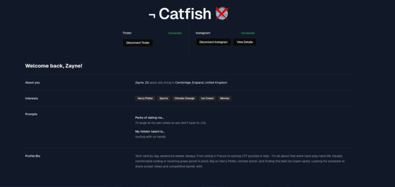
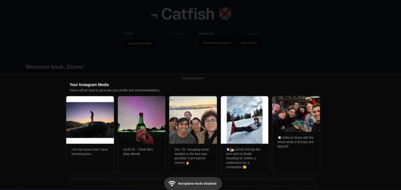
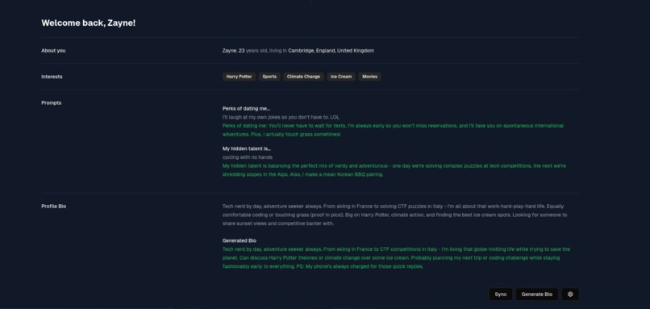
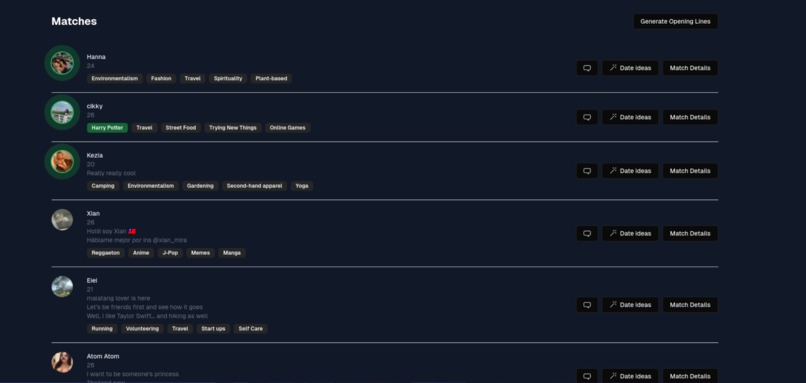
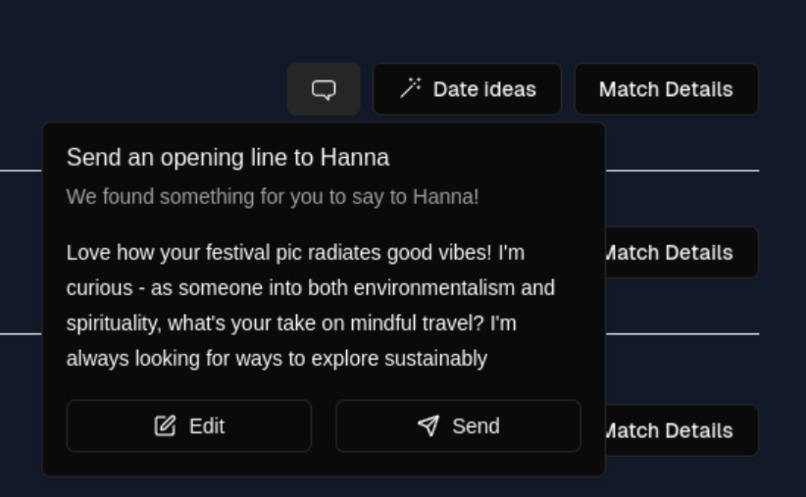
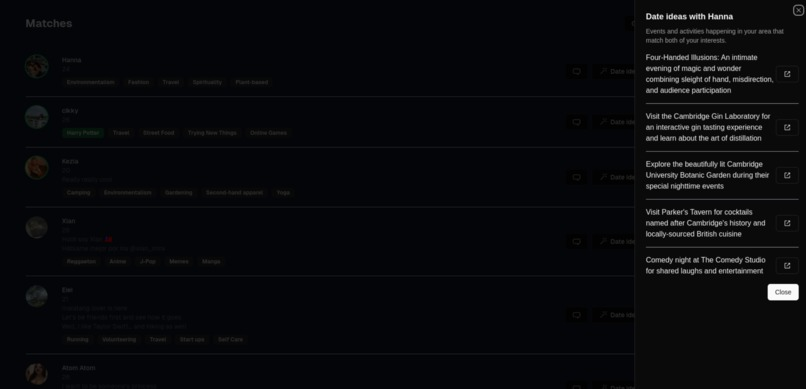
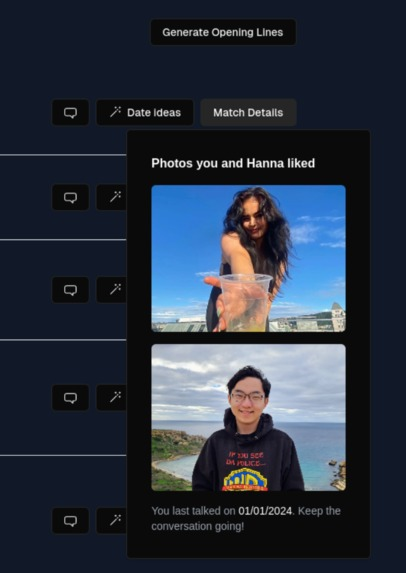
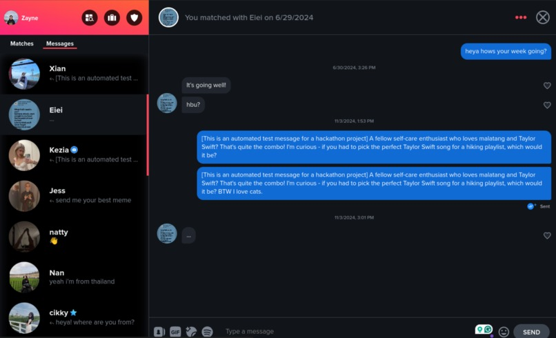

Submission for Cam Hack 2024 at the University of Cambridge.

## Inspiration

Dating apps can be overwhelming. It's often difficult to create genuine responses to every message, so we've noticed a couple of key problems with modern apps:

- Creating an engaging profile that authentically represents you
- Identifying compatible matches
- Starting meaningful conversations that lead to real connections
- Great date ideas

Inspired by these challenges, we created ¬ Catfish (Not Catfish) - an AI-powered dating assistant that helps users optimize their dating profiles and interactions while maintaining authenticity.

## What it does

¬ Catfish provides four key features:

- **Automatic Profile Curation:** Analyzes your Instagram photos, Spotify songs, and app personal information to create a tailored dating profile bio, and personalized responses to profile questions. Sync with Tinder in one click, no need to open Tinder ever again - just show up for the good matches.

- **Match Compatibility:** Analyzes your profile and potential matches, and shared values to identify top matches.

- **Smart Openers:** Generates personalized opening messages for each match. References specific details from match profiles images/bio. Send in one click, no need to open Tinder ever again - just show up for the good matches.

- **Date Ideas:** Suggests personalized date activities based on shared interests in bios. Integrates with Tavily search API for real-time local event recommendations. Provides venue links and relevant details.

## How we built it

Technical Stack:

- Frontend: Next.js, TailwindCSS, Radix UI
- Backend: Flask and Next.js on Vercel Serverless. Integrates with Instagram OAuth and official API + Tinder's reverse-engineered unofficial API (hehe)
- AI Integration: Anthropic's Claude 3.5 Sonnet for natural language processing
- Search Integration: Tavily API for real-time date recommendations

## Gallery

